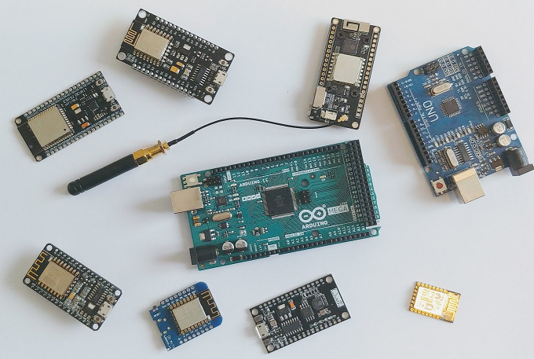

# Boards
OpenMQTTGateway is not closed to one board or type of board, by using the power of the Arduino framework and libraries that are cross compatibles it let you many choice of hardware, from an Arduino UNO to an ESP32.

You can take a look to the components sheet to have a view of [supported boards and components](https://docs.google.com/spreadsheets/d/1_5fQjAixzRtepkykmL-3uN3G5bLfQ0zMajM9OBZ1bx0/edit#gid=1323184277)

Moreover it supports also sensors; DHT, HC SR501, ADC, I2C bus, INA226, TSL2561
Or can actutate things (LED chipsets, relays).

Here is some information to find the board suitable for your need, you have the choice between wifi, ethernet and off the shelves devices:

Off the shelves wifi
* SONOFF RF Bridge
* Sonoff RFR3
* Sonoff Basic
* Wifi RF Gateway

Wifi/Ethernet:
* ESP8266
* ESP32
* Arduino Mega with an ethernet shield
* Arduino Uno with an ethernet shield

Arduino + ethernet shields enables faster responsiveness of the gateway and a reliable connection. 

The ESP platform is more flexible in term of installation (no need of an ethernet cable) but is less reliable in term of communication. Thanks to its higher memory and processing power it has more modules or possibilities compared to arduino Uno & Mega.

Choosing your board depends heavily on the technologies you want to use with it.
To have a good overview of the compatibilities per board you can refer to [this sheet](https://docs.google.com/spreadsheets/d/1_5fQjAixzRtepkykmL-3uN3G5bLfQ0zMajM9OBZ1bx0/edit#gid=1098440301).

The choice between these boards will depend on your knowledge and your requirements in terms of reliability, situation, modules wanted and devices you already have.

